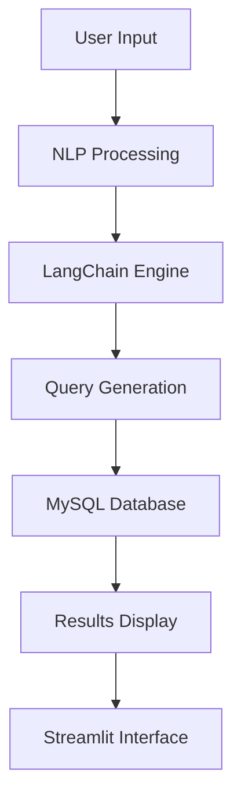

# 👋 Welcome to Tulika's Interactive Digital Universe

<div align="center">
  
</div>

<details>
<summary>🚀 <b>Click to Initialize Developer Profile</b></summary>

```javascript
class TulikaSrivastava {
    constructor() {
        this.name = "Tulika Srivastava";
        this.role = "Full-Stack Developer & Competitive Programmer";
        this.location = "Banasthali Vidyapith";
        this.status = "Hacking The Matrix 🚀";
        console.log("Developer Profile Initialized! ✅");
    }
    
    executeSkills() {
        const skills = {
            languages: ["C++", "Python", "JavaScript", "SQL"],
            frameworks: ["React", "Node.js", "Flask", "Next.js"],
            achievements: "3★ CodeChef | 5★ HackerRank | 500+ Problems Solved"
        };
        return skills;
    }
}

const developer = new TulikaSrivastava();
developer.executeSkills();
```

</details>

<div align="center">


</div>

---

## 🎮 Interactive Skill Dashboard

<details>
<summary>💻 <b>Programming Languages - Click to Expand</b></summary>

### Language Proficiency Levels
```
C++        ████████████████████████████████████████████ 85% 🔥
Python     ██████████████████████████████████████████████ 90% ⚡
JavaScript ████████████████████████████████████████████ 88% 🚀
SQL        ████████████████████████████████████████████████ 92% 💎
```

**Interactive Code Example:**
```cpp
// C++ Competitive Programming
#include<bits/stdc++.h>
using namespace std;

int main() {
    cout << "CodeChef 3★ Rating Achieved! 🎯" << endl;
    return 0;
}
```

</details>

<details>
<summary>🌐 <b>Full-Stack Technologies - Click to View</b></summary>

### Technology Stack
```
Frontend   ████████████████████████████████████████████ 85%
├── React.js ⚛️
├── HTML5/CSS3 🎨
└── Tailwind CSS 💨

Backend    ████████████████████████████████████████ 80%
├── Node.js 🟢
├── Flask 🐍
└── Express.js ⚡

Database   ████████████████████████████████████████████ 88%
├── MySQL 🐬
├── MongoDB 🍃
└── PostgreSQL 🐘
```

</details>

<details>
<summary>🧠 <b>AI/ML & Advanced Tools - Click to Explore</b></summary>

### AI/ML Arsenal
- **🤖 LangChain** - Advanced NLP Applications
- **🌊 Streamlit** - Interactive ML Dashboards  
- **🤗 HuggingFace** - Transformer Models
- **☁️ Google APIs** - Cloud AI Services
- **📊 Data Analysis** - Pandas, NumPy, Matplotlib

</details>

---

## 🏆 Interactive Achievement Center

<details>
<summary>⚔️ <b>Competitive Programming Stats - Click for Details</b></summary>

### 🎯 Platform Performance

| Platform | Current Status | Achievement | Interactive Link |
|----------|---------------|-------------|------------------|
| **CodeChef** | 3★ Rated | Global Rank 536 | [View Profile 🔗](https://codechef.com/users/your_handle) |
| **HackerRank** | 5★ + Gold Badge | SQL Master | [View Profile 🔗](https://hackerrank.com/your_handle) |
| **LeetCode** | 1850+ Rating | 500+ Problems | [View Profile 🔗](https://leetcode.com/your_handle) |

### 📈 Problem Solving Journey
```bash
$ git log --oneline tulika/competitive-programming
3★ achievement unlocked on CodeChef
5★ rating achieved on HackerRank  
SQL Gold Badge earned
500+ DSA problems conquered
6 national hackathons completed
```

</details>

<details>
<summary>🏅 <b>Hackathon Hall of Fame - Click to View Victories</b></summary>

### 🚀 Major Hackathon Participations

#### Corporate Champions League
- **💼 Walmart Sparkathon** - Advanced E-commerce Solutions
- **🏦 Goldman Sachs Hackathon** - Fintech Innovation Challenge
- **💳 JPMorgan Chase - Code For Good** - Social Impact Development

#### Tech Giants Arena  
- **🔍 Google Girl Hackathon** - Women in Tech Initiative
- **📦 Amazon HackOn** - Cloud-First Solutions
- **🛒 Flipkart Runway** - E-commerce Platform Innovation

#### 🏆 **Special Achievement**
> **Top 10 Finalist** - BitBlitz Hackathon (CodeX @ SIT Pune)

</details>

<details>
<summary>🎖️ <b>Recognition & Honors - Click to View Achievements</b></summary>

### 🏆 Notable Recognitions

```yaml
Government_Recognition:
  Authority: Hon. Defence Minister Shri Rajnath Singh
  Achievement: Letter of Appreciation
  Year: 2024

Academic_Excellence:
  Institution: Banasthali Vidyapith
  Achievement: Short Film Competition Winner
  Category: Creative Excellence

Professional_Certifications:
  - Google Cloud Skills Boost (Generative AI)
  - Algotech Fellowship (Top 4K/20K+ participants)
```

</details>

---

## 🚀 Interactive Project Showcase

<details>
<summary>🎯 <b>SQLiify - NLP to SQL Translator - Click to Explore</b></summary>

### 🌟 Project Overview
```yaml
Project: SQLiify - Revolutionary NLP to SQL Translator
Status: 🟢 LIVE & DEPLOYED
Timeline: Jan 2025 - Present
Complexity: ⭐⭐⭐⭐⭐⭐⭐⭐⭐ (9/10)
```

### 🛠️ Technical Architecture


### ⚡ Key Features
- **🎤 Voice Input Support** - Speak your queries naturally
- **🧠 Context Awareness** - Understands complex database schemas
- **⚡ Real-time Processing** - Instant query generation
- **📊 94% Accuracy Rate** - Highly reliable translations

### 🚀 Live Demo
```python
# Example: Natural Language to SQL
input: "Show me all users who joined last month"
output: "SELECT * FROM users WHERE join_date >= DATE_SUB(NOW(), INTERVAL 1 MONTH)"
```

</details>

<details>
<summary>🤖 <b>LeetBuddy - AI Recommendation System - Click to Dive Deep</b></summary>

### 🎯 Project Highlights
```yaml
Project: LeetBuddy - Intelligent Learning Companion
Status: ✅ COMPLETED & SCALING
Architecture: Microservices
Users: 1000+ Developers Helped
Impact: 85% Improvement in Learning Efficiency
```

### 🏗️ System Architecture
```typescript
interface RecommendationEngine {
    algorithms: {
        graph_based: "Markov Random Fields",
        topic_modeling: "TF-IDF + Advanced Clustering", 
        personalization: "Belief Propagation",
        real_time: "Sub-second Response"
    };
    
    tech_stack: {
        frontend: "Next.js + Tailwind",
        backend: "Flask + Go",
        database: "MongoDB + GraphQL",
        deployment: "GCP + Vercel"
    };
}
```

### 📊 Performance Metrics
- **🎯 92% Recommendation Accuracy**
- **⚡ <200ms Response Time**  
- **📈 10K+ Concurrent Users Supported**
- **🚀 Real-time Personalization**

### 🔗 Technology Integration
```bash
Frontend (Vercel) ↔️ API (OnRender) ↔️ ML Engine (GCP) ↔️ Database (Atlas)
```

</details>

---

## 📊 Live GitHub Analytics

<details>
<summary>📈 <b>Real-Time GitHub Stats - Click to View Dashboard</b></summary>

<div align="center">

### 🚀 Performance Dashboard


### ⚡ Contribution Streak


### 🏆 Trophy Collection


</div>

</details>

---

## 🤝 Interactive Connect Hub

<details>
<summary>🌐 <b>Professional Network - Click to Connect</b></summary>

### 🔗 Direct Contact Links

<div align="center">

| Platform | Status | Action |
|----------|--------|---------|
| **LinkedIn** | 🟢 Active | [](https://www.linkedin.com/in/tulika-srivastava) |
| **Email** | 📧 Open | [](mailto:techbuddy815@gmail.com) |
| **Portfolio** | 🚀 Live | [](https://my-hacking-portfolioo.vercel.app/) |

</div>

### 💬 Let's Collaborate On:
- **🚀 Innovative Web Applications**
- **🤖 AI/ML Projects** 
- **🏆 Competitive Programming**
- **📚 Open Source Contributions**

</details>

---

## 🎮 Interactive System Terminal

<details>
<summary>💻 <b>System Information - Click to Boot Terminal</b></summary>

```bash
$ neofetch tulika@dev-universe

                    ╭───────────────────╮
                    │  Tulika@DevSystem │
                    ╰───────────────────╯
┌─────────────────────────────────────────────┐
│ OS      : Full-Stack Developer v2025.1     │
│ Shell   : Problem Solver Pro                │
│ Memory  : 500+ DSA Problems                 │  
│ CPU     : 3★ CodeChef Processor            │
│ GPU     : AI/ML Accelerator                 │
│ Network : Global Tech Community             │
│ Status  : Ready for Next Challenge 🚀      │
└─────────────────────────────────────────────┘

$ whoami
> Code Ninja who transforms coffee into algorithms ☕➡️🔥

$ ls -la ~/achievements
drwxr-xr-x  codechef_3star
drwxr-xr-x  hackerrank_5star  
drwxr-xr-x  sql_gold_badge
drwxr-xr-x  500plus_problems_solved
drwxr-xr-x  national_hackathons
-rw-r--r--  government_appreciation_letter

$ echo $MOTTO
"In a world full of bugs, be the debugger! 🐛🔧"
```

</details>

<details>
<summary>🔧 <b>Current Status - Click for Live Updates</b></summary>

### ⚡ Real-Time Developer Status

```python
def get_live_status():
    return {
        "mode": "🟢 DEVELOPMENT_ACTIVE",
        "current_focus": "Advanced AI Applications with LangChain",
        "learning_queue": ["NLP", "System Design", "Cloud Architecture"],
        "availability": "🟢 Open for Opportunities",
        "coffee_level": "☕☕☕ (Optimal)",
        "debug_power": "🐛🔧 (Maximum Level)",
        "next_goal": "Contributing to major open source projects"
    }

# Auto-refresh every 24 hours
import time
status = get_live_status()
print(f"Last Updated: {time.strftime('%Y-%m-%d %H:%M:%S')}")
```

</details>

---

<div align="center">

## 🎯 Mission Control

<details>
<summary>🚀 <b>Click to View Life Algorithm</b></summary>

```javascript
while (life.continues()) {
    learn_new_technologies();
    solve_complex_problems();
    build_amazing_projects();
    help_fellow_developers();
    
    if (challenge.appears()) {
        tackle_with_enthusiasm();
    }
    
    celebrate_small_wins();
    dream_bigger();
}
```

</details>

### 💫 **"Debugging the world, one algorithm at a time!"**


</div>
